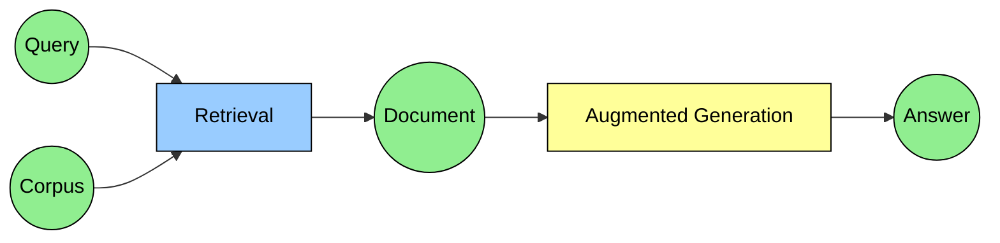
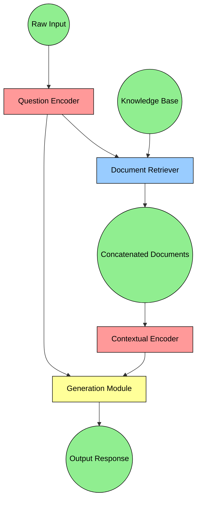
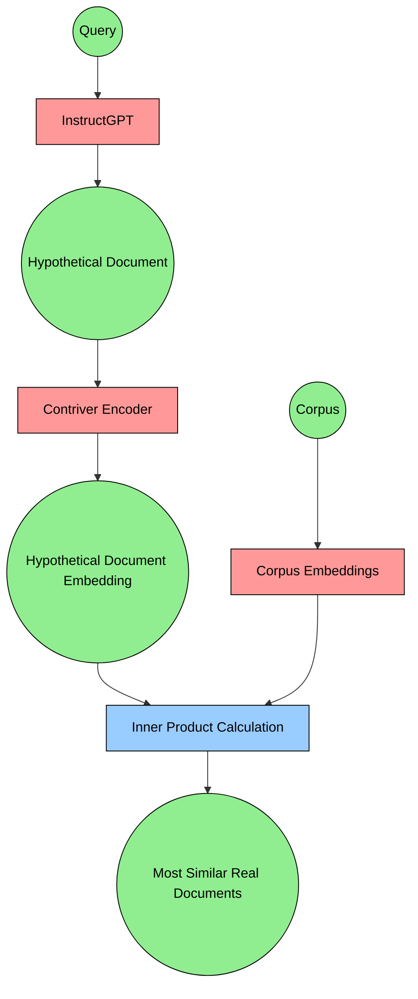
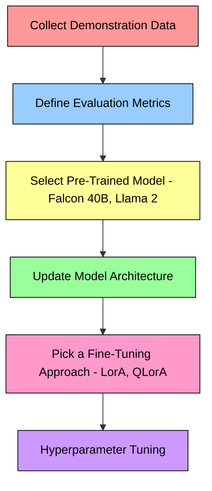
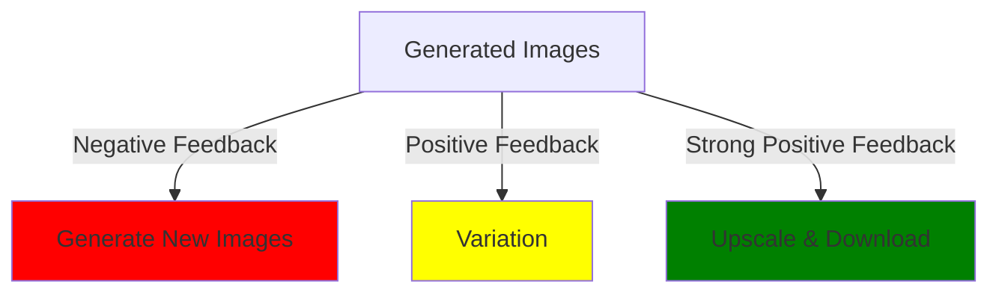

### Summary of Eugene Yan's LLM patterns

adadsfd


graph TD;
A-->B;
A-->C;
B-->D;
C-->D;


- [ ] Patterns for Building LLM based Systems and products
  - [x] Evals
  - [x] RAG
  - [x] Fine-tuning
  - [ ] Caching
  - [x] Guardrails
  - [x] Defensive UX
  - [x] Collect user feedback

My summary of the key ideas from Eugene Yan’s excellent LLM patterns blog post: [https://eugeneyan.com/writing/llm-patterns/](https://eugeneyan.com/writing/llm-patterns/)

[Patterns for Building LLM-based Systems & Products](https://eugeneyan.com/writing/llm-patterns/)

## Evals

**Start by collecting a set of task-specific evals** (i.e., prompt, context, expected outputs as references)

Run eval on each prompt update

Metrics:

- Classification: recall, precision
- Lossier reference metrics: ROUGE, BERTScore, MoverScore

### Automated evaluation via strong LLM

Less noisy, more biased

GPT4 biases:

1. Position bias - 🤖😍 1st position
2. Verbosity bias - 🤖😍 longer answers
3. Self enhancement bias - GPT4 favours own answers by 10%, Claude-v1 favours own answers by 25%

💡 Eugene Yan’s tips:

- Comparison between 2 solutions better rather than asking for a score
- Vibe eval — eyeball prompts periodically

## Retrieval-Augmented Generation (RAG)

Add knowledge to your LLM by retrieving relevant docs and using them to generate answers

RAG, FiD, RETRO are different RAG architectures requiring aligned query, document embeddings

### Document Retrievers

Document retrieval limitations:

☹️ Embedding search poor perf:

- id, person, or object name
- acronym or phrase
- no metadata based filtering, unlike traditional search
- need a vector db

☹️ Traditional search poor perf:

- synonyms (same meaning different words)
- hypernyms (same word different meaning)

💡 Eugene Yan’s tips:

Hybrid retrieval - traditional search index + embedding based search

💡 Without aligned query embeddings and document embeddings use **[Hypothetical document embeddings](https://arxiv.org/abs/2212.10496)**

LLM will generate hypothetical document, then retrieve similar documents based on hypothetical

**Search engine augmented LMs** → \*\*\*\*use Google or Bing search as a document retriever, no need for embeddings

Eugene’s RAG example:

[https://eugeneyan.com/writing/obsidian-copilot/](https://eugeneyan.com/writing/obsidian-copilot/)

https://github.com/eugeneyan/obsidian-copilot

## Fine-tuning

Fine-tuning allows better performance and control

Need significant volume of demonstration data

InstructGPT used 13k instruction-output samples for supervised fine-tuning,
33k output comparisons for reward modeling, and 31k prompts without
human labels as input for RLHF.

**Instruction fine-tuning**: The pre-trained (base)
model is fine-tuned on examples of instruction-output pairs to follow
instructions, answer questions, etc.

)](LLM%20production%20907d6cef22834bac9f6baa9a9cafc915/instructgpt.jpg)

Fine-tuning steps in InstructGPT ([source](https://arxiv.org/abs/2203.02155))

**Single-task fine-tuning**: The pre-trained model is honed
for a narrow and specific task such as toxicity detection or
summarization, similar to BERT and T5.

Fine-tuning techniques: InstructGPT, LorA, QLorA

## 🚧 WIP - Caching

https://github.com/zilliztech/GPTCache

Redis LLM caching example [https://www.youtube.com/watch?v=9VgpXcfJYvw&t=1517s](https://www.youtube.com/watch?v=9VgpXcfJYvw&t=1517s)

)](LLM%20production%20907d6cef22834bac9f6baa9a9cafc915/gptcache.jpg)

Overview of GPTCache ([source](https://github.com/zilliztech/GPTCache))

## Quality Control LLMs

### Guardrails

[Guardrails](https://github.com/ShreyaR/guardrails)

Pydantic style structural, type, and quality requirements on
LLM outputs. If the check fails, it can trigger corrective action such as:

- filtering
- regenerating another response.

Supported validators

1. **Single output value validation:**
   1. output is one of the predefined choices
   2. has a length within a certain range
   3. if numeric, falls within an expected range
   4. is a complete sentence.
2. **Syntactic checks:**
   1. ensure that generated URLs are valid and reachable
   2. Python and SQL code is bug-free.
3. **Semantic checks:** output is aligned with the reference document, or that the extractive summary closely matches the source document via cosine similarity or fuzzy matching
4. **Safety checks:** output is free of
   inappropriate language or that the quality of translated text is high

### NeMo-Guardrails

[NeMo-Guardrails](https://github.com/NVIDIA/NeMo-Guardrails)

Semantic guardrails using LLMs

- **Topical Rails:** The core of the example is designed around ensuring the bot
  doesn't deviate from a specified topic of conversation. This example covers: - Writing basic flows and messages - Covers querying and using a Knowledge Base - Labels: `Topical`; `good first example` - [Link to example](https://github.com/NVIDIA/NeMo-Guardrails/blob/main/examples/topical_rail/README.md)
- **Factual QA:** The example largely focuses on two key aspects - ensuring that
  the bot's response is accurate and mitigates hallucination issues. This example: - Covers querying and using a Knowledge Base - Ensures answers are factual - Reduces hallucination risks - Labels: `Topical` - [Link to example](https://github.com/NVIDIA/NeMo-Guardrails/blob/main/examples/grounding_rail/README.md)
- **Moderating Bots:** Moderation is a complex, multi-pronged approach task. In
  this example, we cover: - Ensuring Ethical Responses - Blocking restricted words - "2 Strikes" ~ shutting down a conversation with a hostile user. - Labels: `Safety`; `Security`; - [Link to example](https://github.com/NVIDIA/NeMo-Guardrails/blob/main/examples/moderation_rail/README.md)
- **Detect Jailbreaking Attempts:** Malicious actors will attempt to overwrite a
  bot's safety features. This example: - Adds jailbreak check on user's input - Labels: `Security` - [Link to example](https://github.com/NVIDIA/NeMo-Guardrails/blob/main/examples/jailbreak_check/README.md)
- **Safe Execution:** LLMs are versatile but some problems are better solved by
  using pre-existing solutions. For instance, if Wolfram|Alpha is great at
  solving a mathematical problem, it is better to use it to solve mathematical
  questions. That said, some security concerns also need to be addressed, given
  that we are enabling the LLM to execute custom code or a third-party service.
  This example: - Walks through some security guideline - Showcases execution for a third-party service - Labels: `Security` - [Link to example](https://github.com/NVIDIA/NeMo-Guardrails/blob/main/examples/execution_rails/README.md)

### Guidance

[Guidance](https://github.com/microsoft/guidance)

Domain-specific language for LLM interactions and output, 😢 no support for GPT4

Good option for open source models probably

Unlike Guardrails which [imposes JSON schema via a prompt](https://github.com/ShreyaR/guardrails/blob/main/guardrails/constants.xml#L14), Guidance enforces the schema by injecting tokens that make up the structure.

Guidance can:

- [generate JSON that’s always valid](https://github.com/microsoft/guidance#guaranteeing-valid-syntax-json-example-notebook)
- [generate complex output formats](https://github.com/microsoft/guidance#rich-output-structure-example-notebook) with multiple keys
- ensure that LLMs [play the right roles](https://github.com/microsoft/guidance#role-based-chat-model-example-notebook)
- [agents interact with each other](https://github.com/microsoft/guidance#agents-notebook).

They also introduced a concept called [token healing](https://github.com/microsoft/guidance#token-healing-notebook)

### How to apply guardrails?

**Structural Guidance:** Apply guidance whenever
possible. It provides direct control over outputs and offers a more
precise method to ensure that output conforms to a specific format

**Syntactic guardrails:** Syntax validation, such as type validation (is this a number?), range validation (are the values within a range of values), JSON validation (is this valid JSON?)

**Content safety guardrails:** These verify that the output has no harmful or inappropriate content. You can use a vocabulary look up such as checking the [List of Dirty, Naughty, Obscene, and Otherwise Bad Words](https://github.com/LDNOOBW/List-of-Dirty-Naughty-Obscene-and-Otherwise-Bad-Words) or using [profanity detection](https://pypi.org/project/profanity-check/) models. (It’s [common to run moderation classifiers on output](https://twitter.com/goodside/status/1685023251532320768).) More complex and nuanced output can rely on an LLM evaluator.

**Semantic/factuality guardrails:** These confirm that
the output is semantically relevant to the input. Say we’re generating a
two-sentence summary of a movie based on its synopsis. We can validate
if the produced summary is semantically similar to the output, or have
(another) LLM ascertain if the summary accurately represents the
provided synopsis.

**Input guardrails:** Input sanitation layer, reducing the risk of inappropriate or adverserial prompts. For example, you’ll get an error if you ask Midjourney to generate NSFW content. Can be done
comparing against a list of strings or using a moderation classifier.

---

## Defensive UX

1. set the right expectations -> add disclaimer to AI content, make data protection and privacy clear to end users
2. enable efficient dismissal -> AI shouldn't frustrate or block
3. provide attribution -> highlighting where suggestions come from
4. anchor on familiarity -> click on text more familiar than chatbots

## Collect user feedback

- Implicit: daily use metrics
- Explicit: thumbs up, thumbs down of AI respone

